## ONE OF BAROQUE SCULPTURES BY FRANCESCO ROBBA AND ONE OF BAROQUE OBJECTS FROM CROATIA AND SLOVENIA

FRANCESCO ROBBA 

|No.|Image|Name|Location|
|:---:|:---:|:---:|:---|
|1|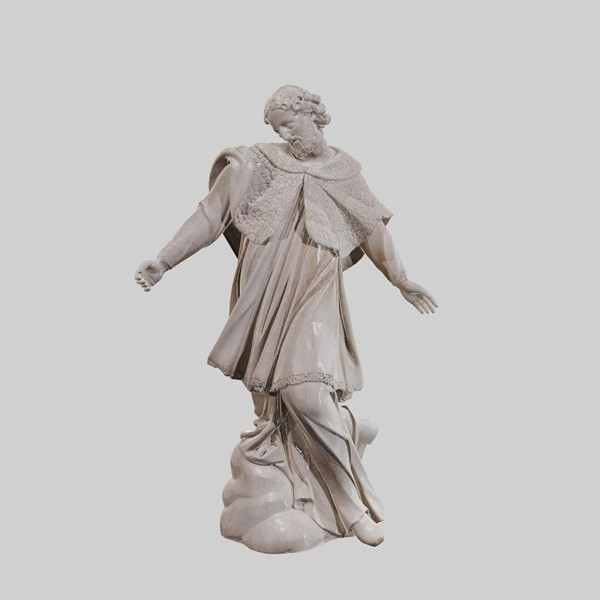|<a href="https://www.rctodc.eu/Collections/Detail/58341" target="_blank">St John of Nepomuk</a>|Austria|
|2|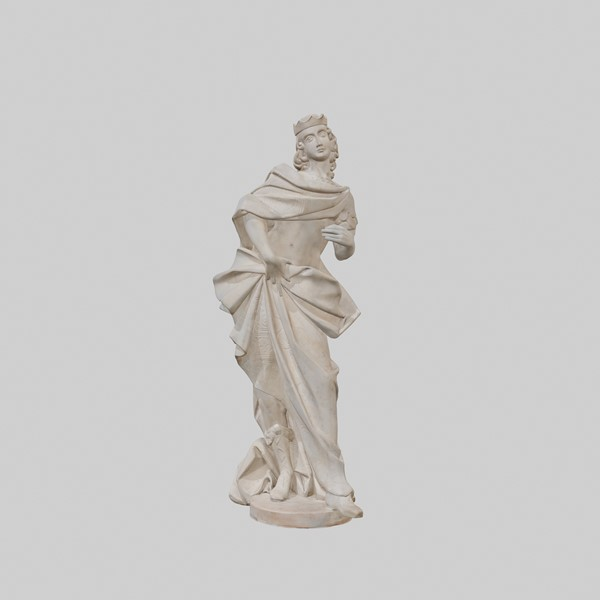|<a href="https://www.rctodc.eu/Collections/Detail/58343" target="_blank">St Leopold</a>|Austria|
|3|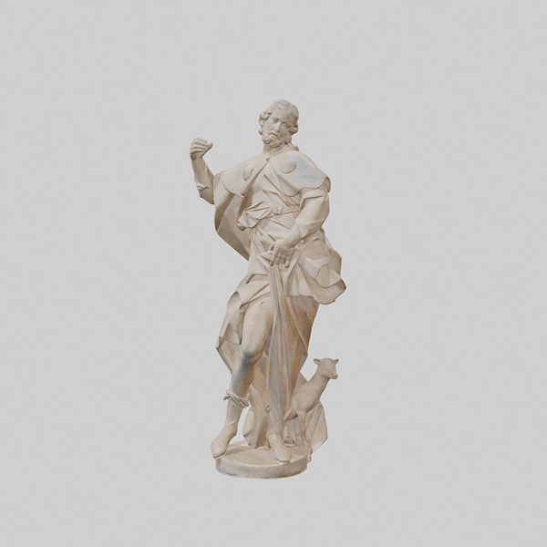|<a href="https://www.rctodc.eu/Collections/Detail/58342" target="_blank">St Roch</a>|Austria|
|4|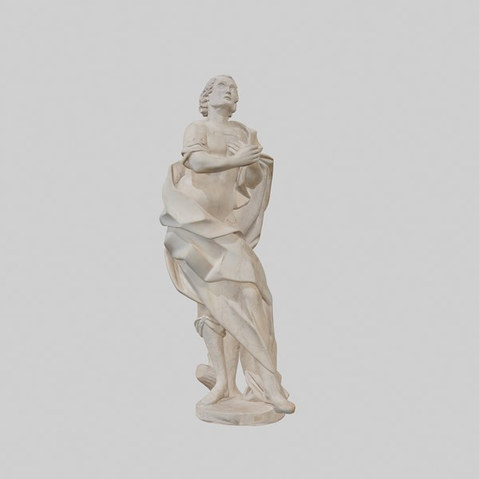|<a href="https://www.rctodc.eu/Collections/Detail/58344" target="_blank">St Sebastian</a>|Austria|
|5|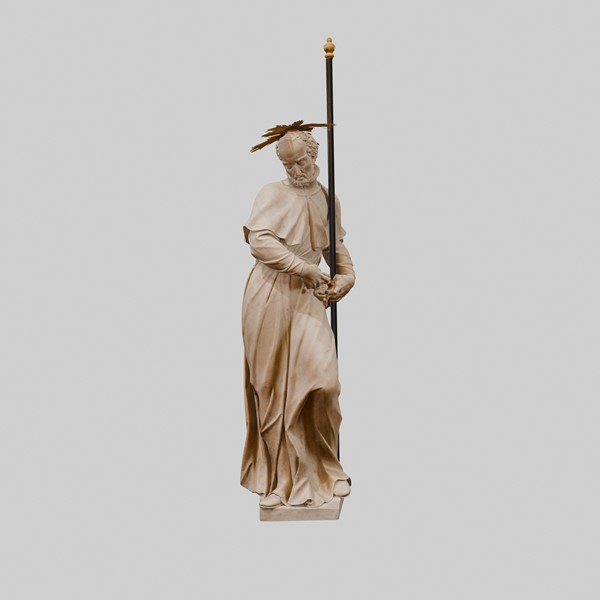|<a href="https://www.rctodc.eu/Collections/Detail/58070" target="_blank">St Francis Regis</a>|Croatia|
|6|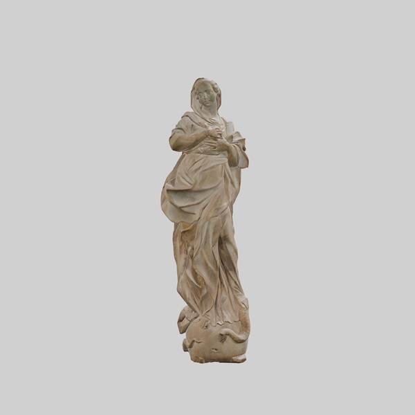|<a href="https://www.rctodc.eu/Collections/Detail/57805" target="_blank">Immaculate Mary</a>|Croatia|
|7|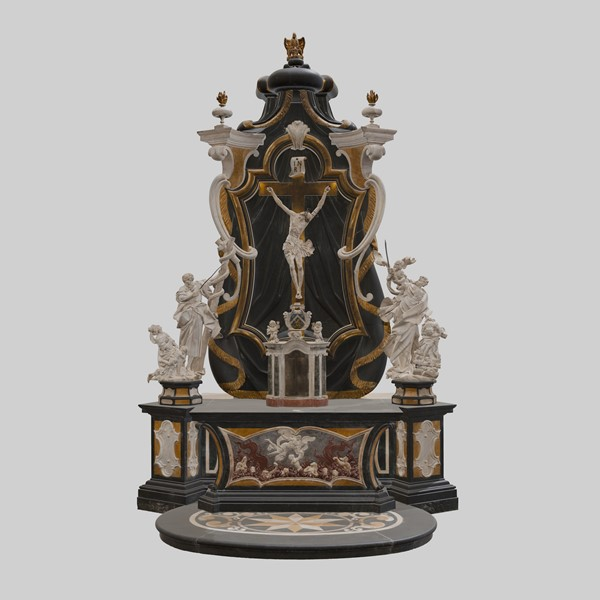|<a href="https://www.rctodc.eu/Collections/Detail/57804" target="_blank">Altar of the Holy Cross</a>|Croatia|
|8|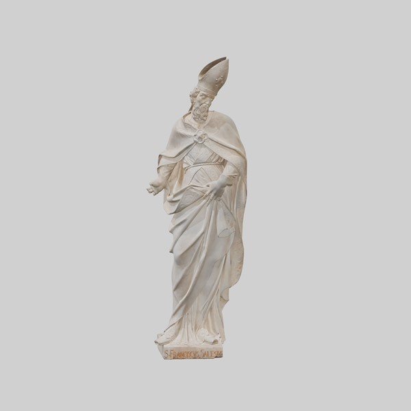|<a href="https://www.rctodc.eu/Collections/Detail/58778" target="_blank">St Francis de Sales</a>|Croatia|
|9|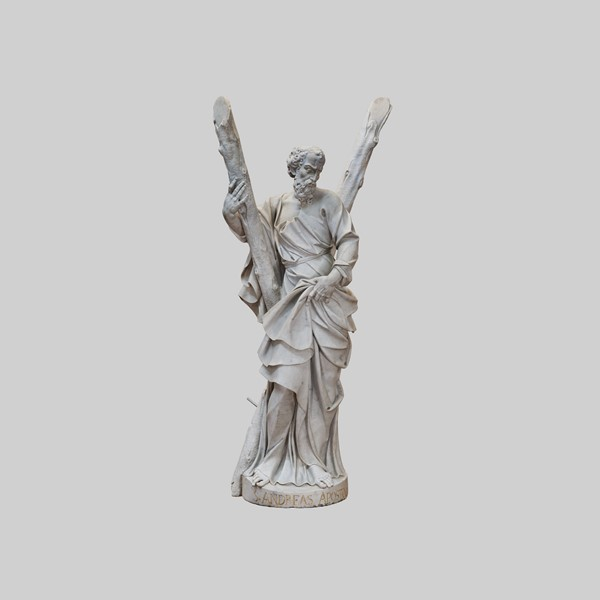|<a href="https://www.rctodc.eu/Collections/Detail/58775" target="_blank">St Andrew the Apostle</a>|Croatia|
|10|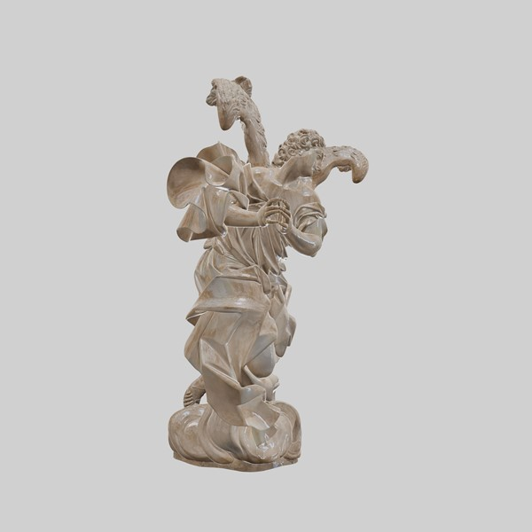|<a href="https://www.rctodc.eu/Collections/Detail/58656" target="_blank">Adoring angel (right), Altar of the Holy Body</a>|Slovenia|
|11|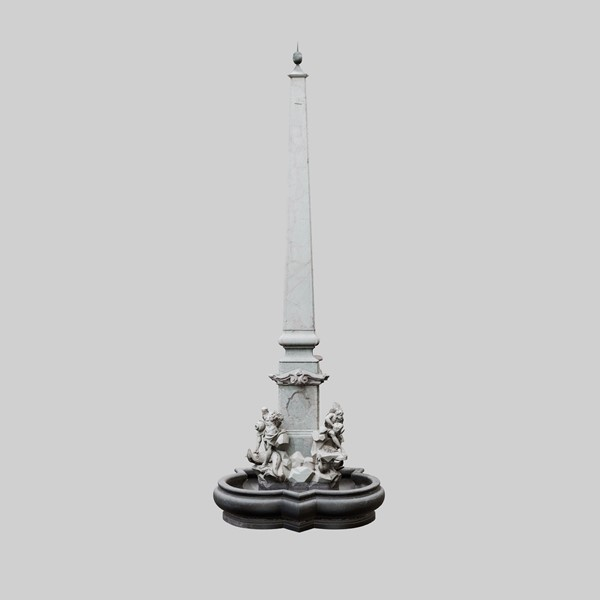|<a href="https://www.rctodc.eu/Collections/Detail/58068" target="_blank">Fountain of the Three Carniolan Rivers</a>|Slovenia|
|12|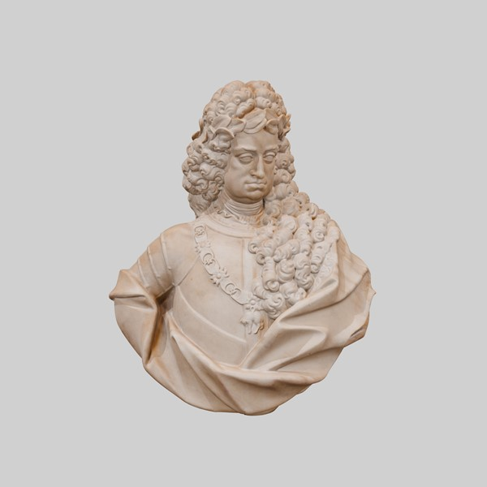|<a href="https://www.rctodc.eu/Collections/Detail/58069" target="_blank">Charles VI, marble</a>|Slovenia|
|13|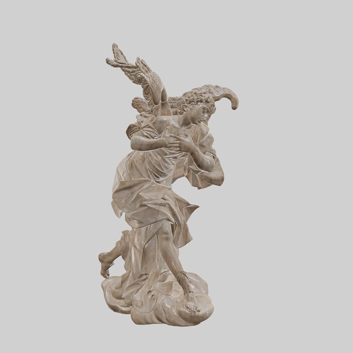|<a href="https://www.rctodc.eu/Collections/Detail/58655" target="_blank">Adoring angel (left), Altar of the Holy Body</a>|Slovenia|
|14|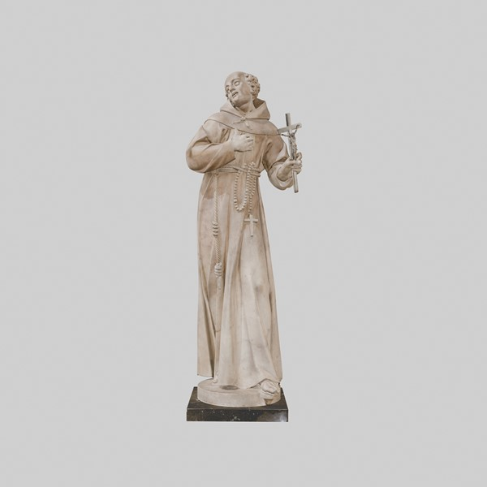|<a href="https://www.rctodc.eu/Collections/Detail/58346" target="_blank">St Anthony of Padua</a>|Slovenia|
|15|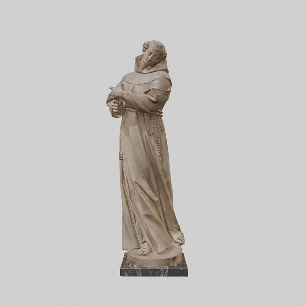|<a href="https://www.rctodc.eu/Collections/Detail/58345" target="_blank">St Bonaventura</a>|Slovenia|

BAROQUE IN SLOVENIA 
National Gallery of Slovenia, City Museum of Ljubljana

|No.|Image|Name|Location|
|:---:|:---:|:---:|:---|
|16|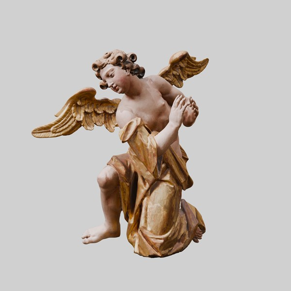|<a href="https://www.rctodc.eu/Collections/Detail/58101" target="_blank">A Kneeling Angel</a>|Slovenia|
|17|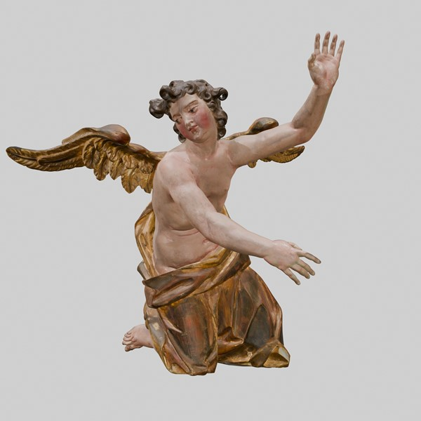|<a href="https://www.rctodc.eu/Collections/Detail/58099" target="_blank">A Kneeling Angel</a>|Slovenia|
|18|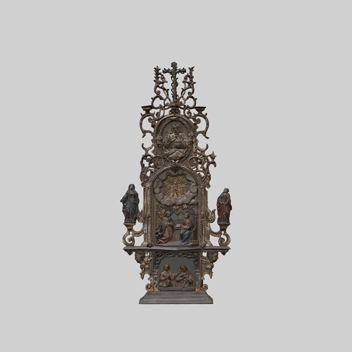|<a href="https://www.rctodc.eu/Collections/Detail/58072" target="_blank">Home altar of the Annunciation of Mary</a>|Slovenia|
|19|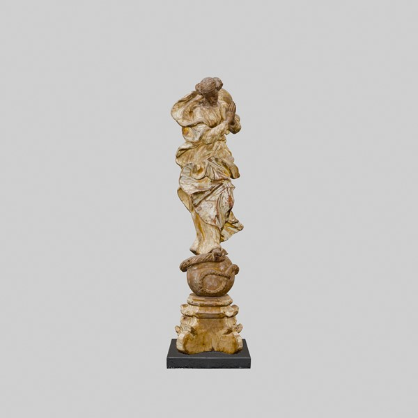|<a href="https://www.rctodc.eu/Collections/Detail/58096" target="_blank">The Immaculate Conception</a>|Slovenia|
|20|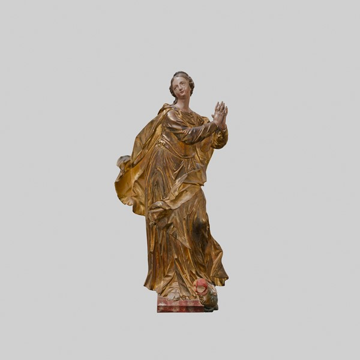|<a href="https://www.rctodc.eu/Collections/Detail/58073" target="_blank">The Immaculate Conception</a>|Slovenia|
|21|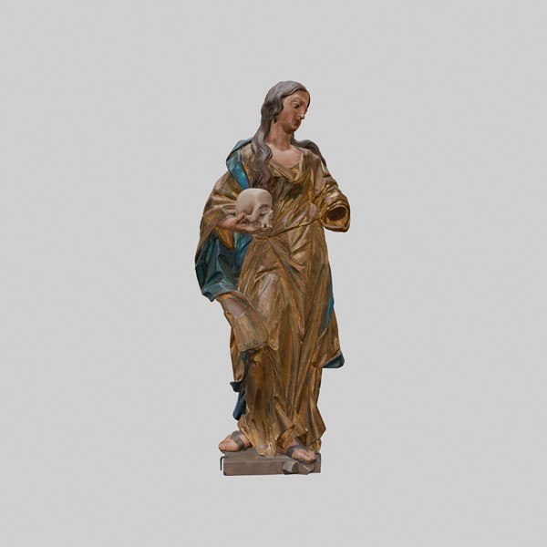|<a href="https://www.rctodc.eu/Collections/Detail/58087" target="_blank">Mary Magdalene</a>|Slovenia|
|22|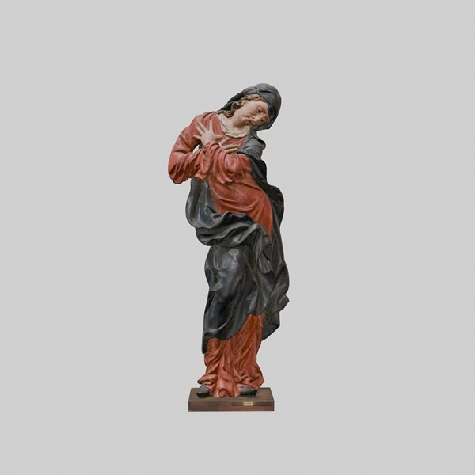|<a href="https://www.rctodc.eu/Collections/Detail/58098" target="_blank">Mother of God</a>|Slovenia|
|23|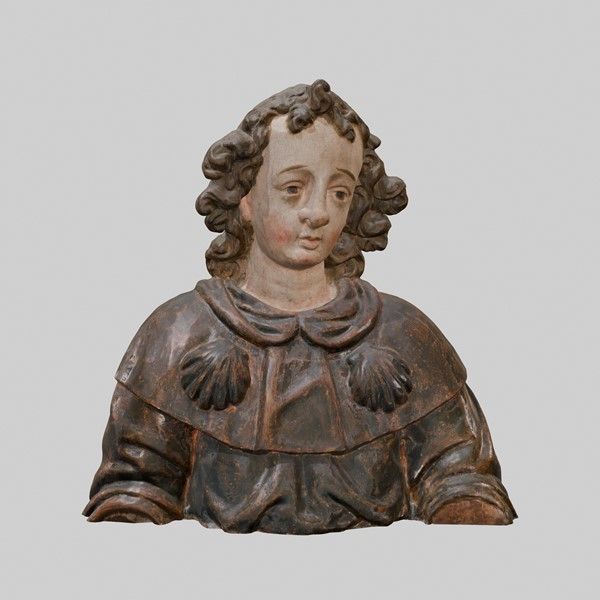|<a href="https://www.rctodc.eu/Collections/Detail/58103" target="_blank">The Bust of a Young Pilgrim Saint</a>|Slovenia|
|24|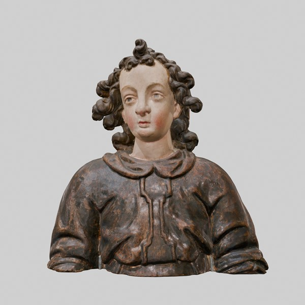|<a href="https://www.rctodc.eu/Collections/Detail/58349" target="_blank">The Bust of a Young Saint</a>|Slovenia|
|25|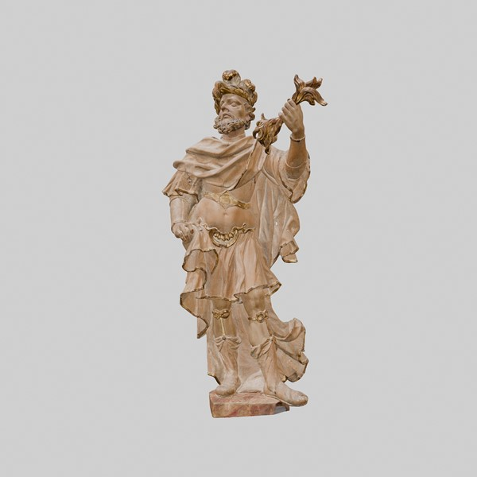|<a href="https://www.rctodc.eu/Collections/Detail/58080" target="_blank">St Donatus</a>|Slovenia|
|26|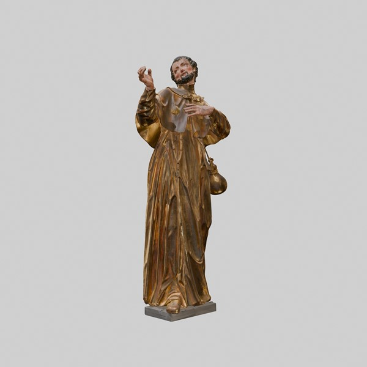|<a href="https://www.rctodc.eu/Collections/Detail/58078" target="_blank">St Francis Xavier</a>|Slovenia|
|27|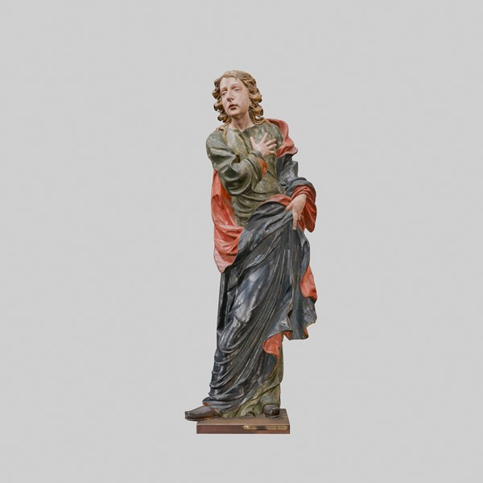|<a href="https://www.rctodc.eu/Collections/Detail/58097" target="_blank">St John the Evangelist</a>|Slovenia|
|28|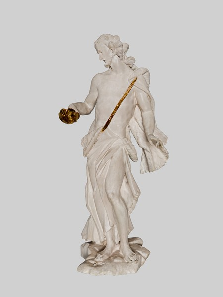|<a href="https://www.rctodc.eu/Collections/Detail/58088" target="_blank">St John the Baptist</a>|Slovenia|
|29|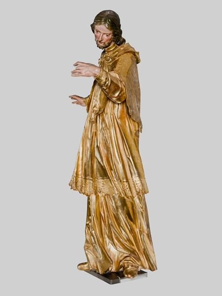|<a href="https://www.rctodc.eu/Collections/Detail/58076" target="_blank">St John of Nepomuk</a>|Slovenia|
|30|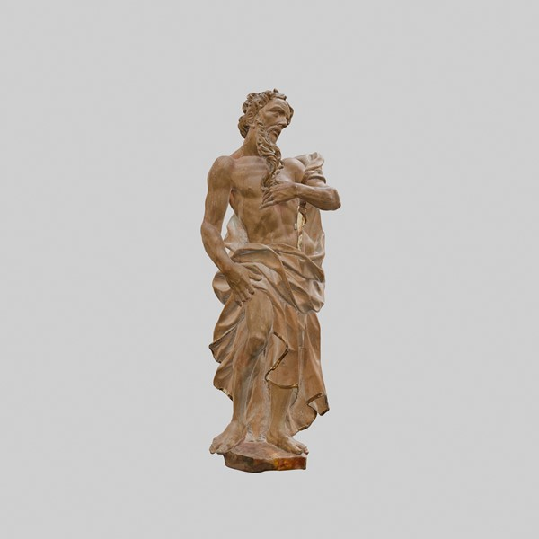|<a href="https://www.rctodc.eu/Collections/Detail/58082" target="_blank">St Jerome</a>|Slovenia|
|31|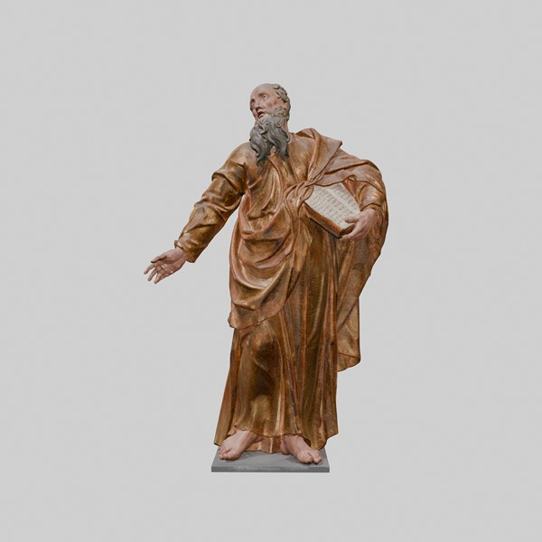|<a href="https://www.rctodc.eu/Collections/Detail/58077" target="_blank">St Paul</a>|Slovenia|
|32|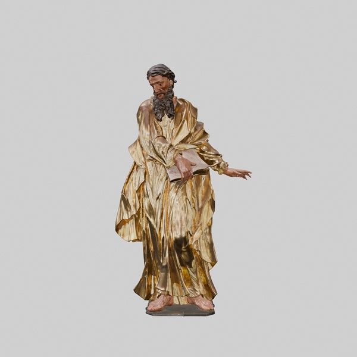|<a href="https://www.rctodc.eu/Collections/Detail/58095" target="_blank">St Paul</a>|Slovenia|
|33|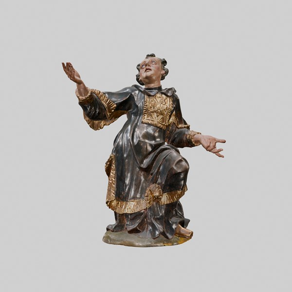|<a href="https://www.rctodc.eu/Collections/Detail/58074" target="_blank">St Stephen, kneeling</a>|Slovenia|
|34|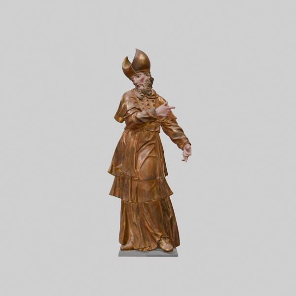|<a href="https://www.rctodc.eu/Collections/Detail/58081" target="_blank">St Zachary</a>|Slovenia|
|35|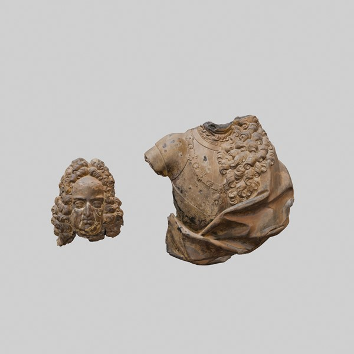|<a href="https://www.rctodc.eu/Collections/Detail/58102" target="_blank">Charles VI, clay</a>|Slovenia|

BAROQUE IN CROATIA 
Zagreb City Museum

|No.|Image|Name|Location|
|:---:|:---:|:---:|:---|
|36|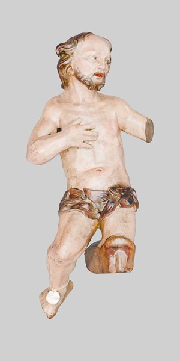|<a href="https://www.rctodc.eu/Collections/Detail/58089" target="_blank">Adam</a>|Croatia|
|37|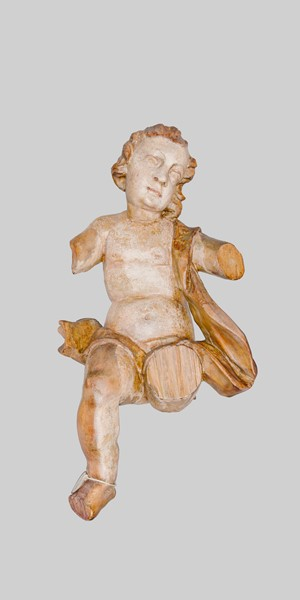|<a href="https://www.rctodc.eu/Collections/Detail/58094" target="_blank">Angel</a>|Croatia|
|38|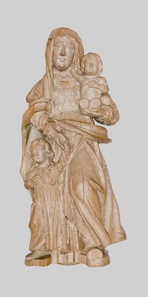|<a href="https://www.rctodc.eu/Collections/Detail/58071" target="_blank">Blessed Virgin Mary with Jesus</a>|Croatia|
|39|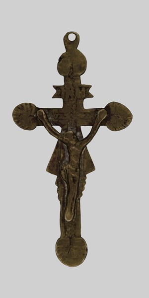|<a href="https://www.rctodc.eu/Collections/Detail/58100" target="_blank">Crucifix</a>|Croatia|
|40|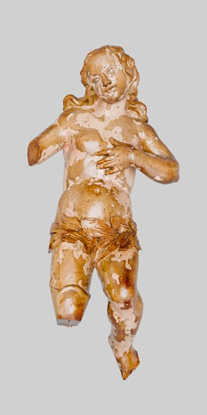|<a href="https://www.rctodc.eu/Collections/Detail/58092" target="_blank">Eve</a>|Croatia|
|41|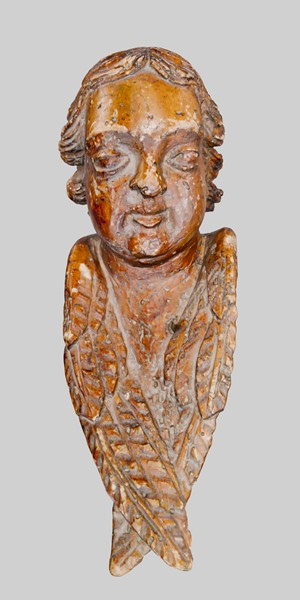|<a href="https://www.rctodc.eu/Collections/Detail/58083" target="_blank">Cherub's head</a>|Croatia|
|42|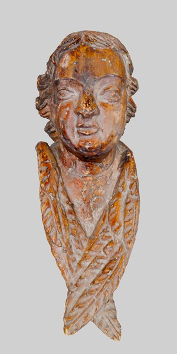|<a href="https://www.rctodc.eu/Collections/Detail/58084" target="_blank">Cherub's head</a>|Croatia|
|43|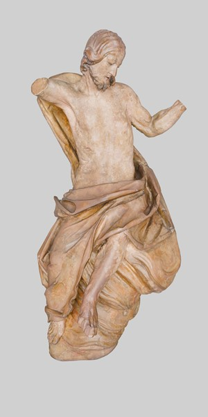|<a href="https://www.rctodc.eu/Collections/Detail/58075" target="_blank">Christ</a>|Croatia|
|44|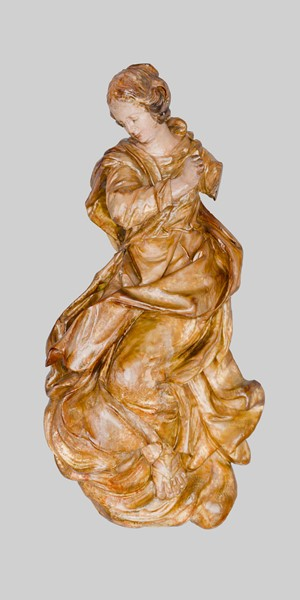|<a href="https://www.rctodc.eu/Collections/Detail/58079" target="_blank">Madonna</a>|Croatia|

